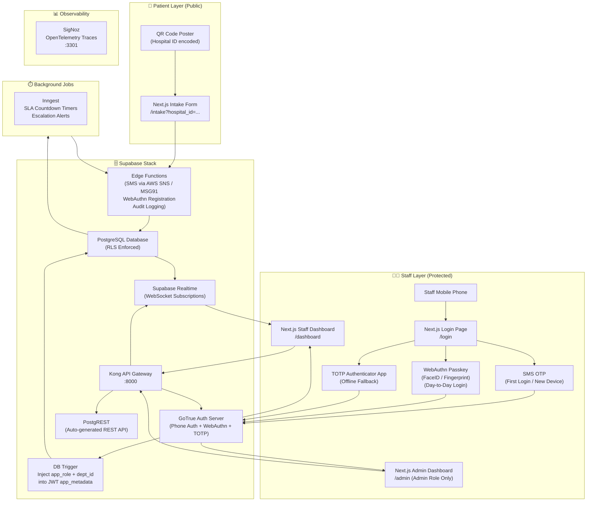

# StayAssist V1 — Revised Architecture
## Authentication: SMS OTP + Biometrics (Passkeys) + TOTP Authenticator App
> **Status:** Proposed | **Replaces:** Authentik SAML SSO Architecture
> **Generated:** 2026-04-15

---

## What Changes vs. The Old Architecture

| Component | Old (Authentik) | New (SMS OTP + Biometric + TOTP) |
|---|---|---|
| **Identity Provider** | Authentik (4 Docker containers) | Supabase GoTrue (already running) |
| **Login Method** | SAML SSO (username + password + TOTP) | Phone Number + SMS OTP → Passkey |
| **Docker Containers** | 20+ containers | 16 containers (4 removed) |
| **RAM Saved** | — | ~1.5 GB freed |
| **Role Storage** | Authentik User Attributes → SAML | `public.users` table → DB Trigger → JWT |
| **Staff Onboarding** | 5 manual steps across 2 systems | 1 step in custom Admin Dashboard |
| **TRAI Compliance** | Not applicable | DLT registration required |

---

## Full System Architecture



---

## The Three-Tier Authentication Flow

### Tier 1: SMS OTP (First Login / New Device Registration)
This is the **entry point** for every staff member and for every new device.

```
Staff opens StayAssist → Enters phone number → Clicks "Send OTP"
    ↓
Next.js calls: supabase.auth.signInWithOtp({ phone: '+919876543210' })
    ↓
Supabase Edge Function:
  → Calls AWS SNS / MSG91 API with DLT PE ID + Template ID
  → SMS delivered: "Your StayAssist OTP is 482910. Valid for 10 minutes."
    ↓
Staff enters OTP → supabase.auth.verifyOtp({ phone, token, type: 'sms' })
    ↓
GoTrue creates session → Database Trigger fires →
  Reads public.users WHERE id = auth.uid()
  Injects { app_role, department_id, hospital_id } into app_metadata JWT
    ↓
Browser stores httpOnly session cookie (8-hour expiry)
    ↓
If new device: Browser prompts "Register FaceID/Fingerprint for faster login?"
  → Staff accepts → WebAuthn Passkey registered (stored in Supabase + device)
    ↓
Redirect to /dashboard (scoped to their department via RLS)
```

### Tier 2: WebAuthn Passkey / Biometrics (Day-to-Day Login)
After the first SMS OTP login, staff use biometrics for all subsequent logins.

```
Staff opens StayAssist → Browser auto-detects registered Passkey
    ↓
"Login with FaceID / Fingerprint" button displayed
    ↓
Staff looks at camera / touches sensor
    ↓
Device Secure Enclave cryptographically signs a challenge
    (Private key NEVER leaves the device)
    ↓
Signature sent to Supabase → GoTrue verifies against stored public key
    ↓
Session created → DB Trigger fires → JWT claims injected
    ↓
Full dashboard access in under 2 seconds. Zero SMS cost.
```

### Tier 3: TOTP Authenticator App (Offline Fallback)
For ICUs, basements, or areas with no network signal.

```
Staff opens Google Authenticator / Microsoft Authenticator app on phone
    ↓
Reads the 6-digit time-based code rotating every 30 seconds
    ↓
Enters code on StayAssist login page
    ↓
Supabase verifies against stored TOTP secret (set during first SMS OTP login)
    ↓
Session created → Dashboard access
```

---

## Database Changes Required

### New: PostgreSQL Trigger to Inject JWT Claims
This single trigger replaces the entire Authentik SAML attribute mapping pipeline.

```sql
-- Migration 025: JWT Claims Injection Trigger
CREATE OR REPLACE FUNCTION public.inject_auth_claims()
RETURNS TRIGGER
LANGUAGE plpgsql
SECURITY DEFINER
AS $$
DECLARE
    user_record public.users%ROWTYPE;
BEGIN
    -- Find the user's profile in public.users
    SELECT * INTO user_record
    FROM public.users
    WHERE id = NEW.id;

    -- Inject role and department into the JWT app_metadata
    IF FOUND THEN
        NEW.raw_app_meta_data := NEW.raw_app_meta_data || jsonb_build_object(
            'app_role',     user_record.role,
            'department_id', user_record.department_id,
            'hospital_id',  user_record.hospital_id
        );
    END IF;

    RETURN NEW;
END;
$$;

CREATE TRIGGER trg_inject_auth_claims
    BEFORE INSERT OR UPDATE ON auth.users
    FOR EACH ROW
    EXECUTE FUNCTION public.inject_auth_claims();
```

### New: WebAuthn Credentials Table
```sql
-- Migration 026: WebAuthn Passkey Storage
CREATE TABLE IF NOT EXISTS public.webauthn_credentials (
    id              UUID PRIMARY KEY DEFAULT gen_random_uuid(),
    user_id         UUID NOT NULL REFERENCES auth.users(id) ON DELETE CASCADE,
    credential_id   TEXT NOT NULL UNIQUE,          -- Browser-generated key ID
    public_key      TEXT NOT NULL,                  -- Stored public key
    device_name     TEXT,                           -- e.g., "iPhone 15 — FaceID"
    created_at      TIMESTAMPTZ NOT NULL DEFAULT NOW(),
    last_used_at    TIMESTAMPTZ
);
```

### New: `user_departments` Table (Multi-Department Support)
```sql
-- Migration 027: Multi-Department Assignment
CREATE TABLE IF NOT EXISTS public.user_departments (
    user_id         UUID NOT NULL REFERENCES public.users(id) ON DELETE CASCADE,
    department_id   UUID NOT NULL REFERENCES public.departments(id) ON DELETE CASCADE,
    is_primary      BOOLEAN NOT NULL DEFAULT FALSE,
    assigned_at     TIMESTAMPTZ NOT NULL DEFAULT NOW(),
    assigned_by     UUID REFERENCES public.users(id),
    PRIMARY KEY (user_id, department_id)
);
```

---

## User Lifecycle Management (Without Authentik)

Since Authentik is removed, the Custom Admin Dashboard becomes the **single source of truth** for managing staff identity. Key lifecycle events:

### Staff Offboarding (Resignation / Termination)
1. Admin clicks **"Deactivate"** on the Staff Management page.
2. Server Action calls `supabase.auth.admin.deleteUser(userId)` — this immediately **kills all active sessions** for that user. They are logged out of every device instantly.
3. Row in `public.users` is soft-deleted: `is_active = false`, `deleted_at = NOW()`.
4. `public.webauthn_credentials` rows are CASCADE deleted automatically (all registered Passkeys destroyed).
5. An immutable record is written to `public.audit_logs` (who deactivated them, at what time).

### Department Transfer
1. Admin opens staff member's profile → clicks **"Change Department"**.
2. New `department_id` is updated in `public.users`.
3. The DB Trigger on `auth.users` fires on next login → new JWT has updated `department_id`.
4. If the session is currently active, `supabase.auth.admin.updateUserById()` is called to force a JWT refresh immediately (no waiting until next login).
5. Audit log entry: `"Department changed from ICU to Cardiology by admin@hospital.org at 14:32 IST"`.

#### 🤖 Automated Department Transfer — Available Options

Manually clicking through a dashboard for every transfer is viable for small hospitals but becomes tedious at scale. Here are three levels of automation:

**Option A: HR Roster Webhook (Best for Large Hospital Chains)**
If your hospital uses existing HR/shift rostering software (Kronos, Keka, SAP HR, Oracle HCM, or even a simple Excel-based roster), you expose a secure API endpoint in Next.js:
```
POST /api/internal/transfer-department
Authorization: Bearer <INTERNAL_WEBHOOK_SECRET>
{
  "staff_phone": "+919876543210",
  "new_department_id": "uuid-of-cardiology",
  "effective_from": "2026-04-16T08:00:00+05:30"
}
```
The HR software calls this webhook whenever a roster change is saved. Your system processes it automatically, updates the database, refreshes the JWT, and logs the audit trail — zero admin manual intervention required.

**Option B: Scheduled Database Cron (Best for Shift-Based Rotations)**
If department assignments change on a fixed weekly/monthly schedule (e.g., Nurses rotate ICU → General Ward every 2 weeks), use Supabase `pg_cron`:
```sql
-- Runs every Sunday at midnight, processes all pending scheduled transfers
SELECT cron.schedule(
  'process-department-transfers',
  '0 0 * * 0',  -- Every Sunday at 00:00
  $$
    UPDATE public.users u
    SET department_id = t.new_department_id
    FROM public.scheduled_transfers t
    WHERE t.user_id = u.id
      AND t.effective_from <= NOW()
      AND t.processed_at IS NULL;

    UPDATE public.scheduled_transfers
    SET processed_at = NOW()
    WHERE effective_from <= NOW() AND processed_at IS NULL;
  $$
);
```
Admins schedule transfers weeks in advance via the dashboard. The database executes them automatically at the right date and time.

**Option C: Clock-In Auto-Detection (Best for On-Call / Float Staff)**
For staff who rotate between departments daily (float nurses, on-call doctors), instead of tracking exact transfer dates, use the **Clock-In Button** approach:
- When Dr. Sharma clocks in, the dashboard asks: *"Which department are you working in today?"*
- Her department context is set for that shift only.
- At shift end (Clock-Out), her context resets to her primary department.
- No admin involvement needed whatsoever — fully self-service.

### Role Upgrade (e.g., Nurse → Department Manager)
Same flow as Department Transfer: Admin updates role in the dashboard, JWT claims are refreshed via `updateUserById()`, and RLS immediately enforces new access boundaries.

---

## Admin Dashboard — Security Architecture

The Custom Admin Dashboard at `/admin` requires **three distinct security layers** AND a strictly controlled login and onboarding process of its own.

---

### 🔐 Admin Login Process

The Admin Dashboard login is intentionally **different and stricter** than regular staff login. Regular staff log in with Phone + SMS OTP. Admins must complete all three authentication factors:

```
Step 1 — Phone + SMS OTP (Identity Verification)
  Admin enters their registered phone number
  → OTP sent to registered mobile
  → Admin enters 6-digit code
  → GoTrue confirms identity

Step 2 — TOTP Authenticator App (Mandatory for Admin Role)
  After OTP verification, system checks: app_role === 'Admin'
  → If Admin role detected: system FORCES a second factor
  → Admin opens Google Authenticator / Microsoft Authenticator
  → Enters the 6-digit rotating TOTP code
  → Only after BOTH factors pass does the session upgrade to AAL2
    (Authentication Assurance Level 2 — the highest Supabase security tier)

Step 3 — Session Lock to Admin Device (Optional but Recommended)
  Admin's device registers a WebAuthn Passkey after first successful login
  → Daily logins: FaceID/Fingerprint + TOTP (SMS skipped on known device)
  → Unknown device attempt: Full SMS OTP + TOTP challenge enforced again
```

**Why Two Factors for Admins?**
A regular nurse accessing the wrong department is a minor RLS policy issue. A compromised Admin account can create new users, deactivate all staff, and read audit logs across the entire hospital chain. The AAL2 requirement is non-negotiable for NABH/JCI compliance.

This is already enforced in your current `middleware.ts`:
```typescript
// middleware.ts — AAL2 enforcement for admin routes
if (pathname.startsWith('/admin')) {
    const { data: { session } } = await supabase.auth.getSession();
    const aal = session?.user?.app_metadata?.aal;
    const role = session?.user?.app_metadata?.app_role;

    // Bounce non-admins silently
    if (role !== 'Admin') {
        return NextResponse.redirect('/dashboard');
    }

    // Force AAL2 — redirect to MFA challenge if only AAL1 session
    if (aal !== 'aal2') {
        return NextResponse.redirect('/auth/mfa-challenge');
    }
}
```

---

### 🧑‍💼 Admin Onboarding Process

The **very first Admin account** (the Super Admin) is bootstrapped differently from all other users — it cannot be created through the Admin Dashboard itself (since the dashboard doesn't exist yet). Here is the exact sequence:

**Step 1 — Database Bootstrap (One-Time, Run Once)**
The Super Admin account is created directly in the database during initial setup:
```sql
-- Run once via Supabase Studio SQL Editor on first deployment
-- Step 1: Register phone in auth system
SELECT supabase_admin.create_user(
  jsonb_build_object(
    'phone', '+919000000000',
    'phone_confirm', true,
    'app_metadata', jsonb_build_object('app_role', 'Admin')
  )
);

-- Step 2: Create profile in public.users
INSERT INTO public.users (id, phone, first_name, last_name, role, hospital_id, is_active)
VALUES (
  '<AUTH_ID_FROM_ABOVE>',
  '+919000000000',
  'System', 'Administrator',
  'Admin',
  '<HOSPITAL_ID>',
  TRUE
);
```

**Step 2 — Super Admin Logs In and Sets Up TOTP**
1. Super Admin opens StayAssist → enters phone number → receives SMS OTP.
2. Logs in successfully (AAL1 session).
3. System detects `app_role = Admin` but `aal = aal1` → immediately redirects to TOTP setup page.
4. Super Admin scans QR code with Google Authenticator.
5. Enters the first TOTP code to confirm setup → session upgrades to AAL2.
6. Admin Dashboard at `/admin` is now accessible.

**Step 3 — All Subsequent Admins Created via the Dashboard**
Once the Super Admin is inside the Admin Dashboard:
1. Navigate to **Staff Management → Add New Staff**.
2. Fill in details and select role = **Admin** from the dropdown.
3. The new admin receives a welcome SMS.
4. On their first login, they are automatically forced through TOTP setup before gaining Admin Dashboard access.
5. Zero SQL required ever again.

**Admin Role Hierarchy:**
| Role | Can Access | Can Create |
|---|---|---|
| `Admin` | Full Admin Dashboard, all hospitals | Other Admins, any staff |
| `hospital_admin` | Own hospital only | Staff within their hospital |
| `department_manager` | Staff Dashboard only | Cannot create users |

---

### Layer 1: Route Guard (Middleware)
```typescript
// middleware.ts
if (pathname.startsWith('/admin')) {
    const role = session?.user?.app_metadata?.app_role;
    if (role !== 'Admin') {
        return NextResponse.redirect('/dashboard'); // Non-admins silently bounced
    }
}
```

### Layer 2: Supabase Service Role Key (Server-Side Only)
All Admin Dashboard mutations (create user, deactivate user, change role) use the `SUPABASE_SERVICE_ROLE_KEY` which:
- **Never** touches the browser (server-side only in Next.js Server Actions).
- Bypasses all RLS policies (intentionally — admin needs full access).
- Is stored exclusively in `.env` as a secret variable, never in client-side bundles.

### Layer 3: Audit Log on Every Action
Every single admin action — creating a user, changing a role, deactivating staff — writes an immutable row to `public.audit_logs`. This cannot be deleted (Supabase RLS + REVOKE DELETE). This satisfies NABH/JCI compliance requirements.

---

## Infrastructure Comparison (Docker Containers)

### Old (With Authentik):
```
supabase-db, supabase-auth, supabase-rest, supabase-realtime,
supabase-storage, supabase-studio, supabase-kong, supabase-meta,
supabase-analytics, supabase-edge-functions, supabase-pooler,
supabase-imgproxy, supabase-vector,
applicationv40-server-1 (Authentik),   ← REMOVED
applicationv40-worker-1 (Authentik),   ← REMOVED
applicationv40-postgresql-1,           ← REMOVED
applicationv40-redis-1,                ← REMOVED
applicationv40-cloudflared-1,
signoz, signoz-clickhouse
```
**Total: 20 containers**

### New (Without Authentik):
```
supabase-db, supabase-auth, supabase-rest, supabase-realtime,
supabase-storage, supabase-studio, supabase-kong, supabase-meta,
supabase-analytics, supabase-edge-functions, supabase-pooler,
supabase-imgproxy, supabase-vector
```
**Total: 13 containers | RAM Freed: ~2.5 GB | Complexity Reduced: Significantly**

---

## Security Summary

| Layer | Mechanism | Protects Against |
|---|---|---|
| **Auth Tier 1** | SMS OTP + TRAI DLT | Unauthorized access, password attacks |
| **Auth Tier 2** | WebAuthn Passkey (FaceID) | SIM swapping, SMS interception, phishing |
| **Auth Tier 3** | TOTP App | Network outages, SMS delivery failures |
| **Session** | 8-hour JWT expiry + httpOnly cookie | Stolen devices, XSS cookie theft |
| **Database** | Row Level Security (RLS) | Cross-department data leaks |
| **Admin Routes** | Middleware role guard + Service Key | Unauthorized admin access |
| **Rate Limiting** | Cloudflare Turnstile + Supabase OTP limit | SMS Toll Fraud, brute-force bots |
| **Audit Trail** | Immutable `audit_logs` table | Compliance, insider threat detection |
| **IP Guard** | Middleware IP whitelist (optional) | Access from outside hospital network |
