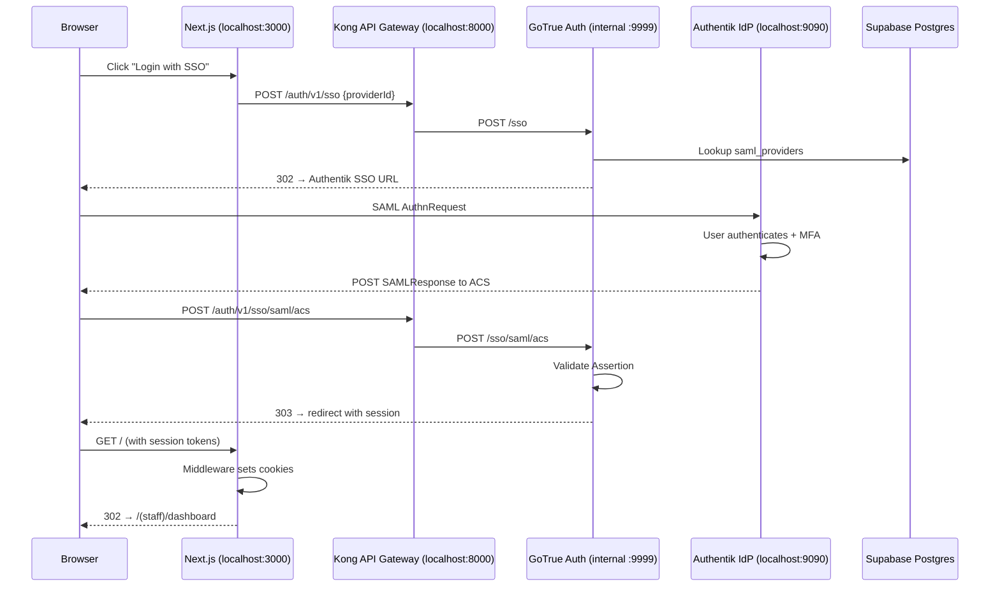

# SAML SSO Technical Audit Report — Antigravity Platform

**Date:** 2026-03-18 | **Sprint:** 7.1 | **Severity:** CRITICAL (login blocked)
**Auditor:** Antigravity AI Engineering | **Status:** 🔴 OPEN — 1 remaining blocker

---

## Executive Summary

The Antigravity platform uses a **SAML 2.0 Single Sign-On (SSO)** flow to authenticate hospital staff via **Authentik** (Identity Provider) through **Supabase GoTrue** (Service Provider). During Sprint 7.1, a persistent redirect loop was discovered where successful authentication at Authentik always bounced the user back to `http://localhost:3000/login` instead of the staff dashboard.

Over the course of debugging, **six distinct SAML configuration errors** were identified and resolved sequentially. **Five of six** have been fixed. **One critical blocker remains** (Audience Restriction mismatch).

---

## Architecture Overview



---

## Issues Discovered & Resolution Status

### Issue 1: Kong API Key Blocking SAML ACS ✅ RESOLVED

| Field | Value |
|-------|-------|
| **Error** | `No API key found in request` |
| **Component** | Kong API Gateway |
| **Root Cause** | The SAML ACS callback (`POST /auth/v1/sso/saml/acs`) was caught by Kong's catch-all `/auth/v1/` route which enforces `key-auth`. Authentik's browser POST redirect carries no API key. |
| **Fix Applied** | Added 3 open Kong service routes (no `key-auth` plugin) for `/auth/v1/sso/saml/acs`, `/auth/v1/sso/saml/metadata`, and `/auth/v1/sso` **before** the secure catch-all route. |
| **File Modified** | [kong.yml](file:///C:/supabase-volumes/api/kong.yml#L66-L93) |

```yaml
## Open SAML SSO routes - no API key
- name: auth-v1-open-saml-acs
  url: http://auth:9999/sso/saml/acs
  routes:
    - name: auth-v1-open-saml-acs
      strip_path: true
      paths:
        - /auth/v1/sso/saml/acs
  plugins:
    - name: cors
```

> [!IMPORTANT]
> **Why do two [kong.yml](file:///C:/supabase-volumes/api/kong.yml) files exist?** This is **intentional, not a mistake**.
>
> | File | Purpose |
> |------|---------|
> | [c:\Application V4.0\supabase\docker\volumes\api\kong.yml](file:///Application%20V4.0/supabase/docker/volumes/api/kong.yml) | **Source template** in the Git repo. Contains `${ENV_VAR}` placeholders. This is what developers edit and commit. |
> | [C:\supabase-volumes\api\kong.yml](file:///C:/supabase-volumes/api/kong.yml) | **Live runtime copy** mounted into the Kong container as a Docker volume (`-v C:/supabase-volumes/api/kong.yml:/home/kong/temp.yml:ro`). |
>
> **How it works:** The Kong container's custom entrypoint runs `eval "echo \"$(cat ~/temp.yml)\"" > ~/kong.yml` at startup. This reads `temp.yml` (the volume mount), performs shell environment variable substitution on any `${VAR}` tokens, and writes the final resolved [kong.yml](file:///C:/supabase-volumes/api/kong.yml) that Kong actually loads.
>
> **The problem we hit:** During this debug session, edits were initially made to the repo template only. Since the live volume is a separate copy, Kong never saw those changes. **Both files must be kept in sync manually** — or better, the deployment script should copy the repo template to the volume path before starting Docker.

---

### Issue 2: SAML Issuer EntityID Mismatch ✅ RESOLVED

| Field | Value |
|-------|-------|
| **Error** | `response Issuer does not match the IDP metadata (expected "http://localhost:8000")` |
| **Component** | GoTrue → Postgres `saml_providers` table |
| **Root Cause** | Authentik emits `<saml:Issuer>http://localhost:8000/auth/v1</saml:Issuer>` in its SAML Response. But the `entity_id` column in `saml_providers` was set to `http://localhost:9090/if/saml/antigravity` (the Authentik slug), not the value Authentik actually uses as its Issuer. |
| **Fix Applied** | Updated `entity_id` to `http://localhost:8000/auth/v1` via SQL. Also updated `entityID` attribute inside `metadata_xml` column. |

```sql
UPDATE saml_providers
SET entity_id = 'http://localhost:8000/auth/v1',
    metadata_xml = replace(metadata_xml,
      'entityID="http://localhost:8000"',
      'entityID="http://localhost:8000/auth/v1"')
WHERE id = 'c2a666b8-f53c-4e57-8d28-95e3c2b85d91';
```

> [!IMPORTANT]
> GoTrue caches SAML provider metadata in memory. After any database change to `saml_providers`, the `supabase-auth` container **must be restarted** (`docker restart supabase-auth`) for changes to take effect.

---

### Issue 3: Missing SAML Assertion Signature ✅ RESOLVED

| Field | Value |
|-------|-------|
| **Error** | `signature element not present` |
| **Component** | Authentik Provider configuration |
| **Root Cause** | Authentik defaults to **unsigned** SAML assertions. GoTrue strictly requires cryptographic signatures on all assertions for HIPAA-grade security. |
| **Fix Applied** | In Authentik Admin → Providers → Edit: enabled **Signing Keypair** = `authentik Self-signed Certificate` and checked **Sign Assertion**. |

---

### Issue 4: Missing Signing Certificate in GoTrue Metadata ✅ RESOLVED

| Field | Value |
|-------|-------|
| **Error** | `500: Unable to find any signing certificate in the IDP` |
| **Component** | GoTrue → Postgres `saml_providers.metadata_xml` |
| **Root Cause** | After enabling assertion signing, the metadata XML stored in Postgres still lacked the `<md:KeyDescriptor use="signing">` block containing Authentik's X.509 public certificate. GoTrue could not verify the signatures. |
| **Fix Applied** | Downloaded the updated Authentik SAML metadata XML (which now includes the signing certificate) and injected it into the `metadata_xml` column via SQL. |

---

### Issue 5: Authentik Request Signature Verification ✅ RESOLVED

| Field | Value |
|-------|-------|
| **Error** | `Bad Request: Failed to verify signature` (Authentik-side) |
| **Component** | Authentik Provider configuration |
| **Root Cause** | When a **Verification Certificate** was set in Authentik, it attempted to verify the digital signature of the incoming `AuthnRequest` from GoTrue. GoTrue does not sign its outgoing requests by default, causing Authentik to reject them. |
| **Fix Applied** | Cleared the **Verification Certificate** field in the Authentik Provider configuration. |

---

### Issue 6: SAML Audience Restriction Mismatch 🔴 OPEN — CURRENT BLOCKER

| Field | Value |
|-------|-------|
| **Error** | `assertion Conditions AudienceRestriction does not contain "http://localhost:8000/auth/v1/sso/saml/metadata"` |
| **Component** | Authentik Provider → Audience field + GoTrue validation logic |
| **Root Cause** | GoTrue expects the SAML `<saml:Audience>` to be exactly `http://localhost:8000/auth/v1/sso/saml/metadata` (its own metadata endpoint). Authentik is sending `http://localhost:8000/auth/v1` (the EntityID) as the Audience instead. |
| **Current Authentik Audience Value** | `http://localhost:8000/auth/v1` (incorrect, previously had typo `saaml`) |
| **Required Value** | `http://localhost:8000/auth/v1/sso/saml/metadata` |

> [!CAUTION]
> This is the **last remaining blocker**. The Audience field in Authentik's SAML Provider **Advanced protocol settings** must be set to exactly `http://localhost:8000/auth/v1/sso/saml/metadata`. The browser subagent attempted this fix but encountered an existing typo (`saaml` instead of `saml`) and 504 Gateway Timeout errors during testing. **Manual verification is required.**

**Required Fix:**
1. Authentik Admin → Applications → Providers → Edit `Supabase GoTrue SAML`
2. Expand **Advanced protocol settings**
3. Set **Audience** to: `http://localhost:8000/auth/v1/sso/saml/metadata`
4. Click **Update**
5. Restart GoTrue: `docker restart supabase-auth`
6. Retry login

---

## Current Configuration State

### Postgres `saml_providers` Table

| Column | Current Value |
|--------|---------------|
| [id](file:///c:/Application%20V4.0/src/middleware.ts#12-100) | `c2a666b8-f53c-4e57-8d28-95e3c2b85d91` |
| `sso_provider_id` | `0bafa784-84f5-4dc8-80e8-abb8c8ce6ae7` |
| `entity_id` | `http://localhost:8000/auth/v1` |
| `metadata_url` | *(empty — uses inline XML)* |
| `metadata_xml` | Contains `entityID="http://localhost:8000/auth/v1"` + X.509 signing cert |

### GoTrue Environment Variables ([docker-compose.yml](file:///c:/Application%20V4.0/supabase/docker/docker-compose.yml))

| Variable | Value |
|----------|-------|
| `GOTRUE_EXTERNAL_SAML_ENABLED` | `true` |
| `GOTRUE_SAML_ENABLED` | `true` |
| `GOTRUE_SAML_PRIVATE_KEY` | *(set — RSA private key for SP signing)* |
| `API_EXTERNAL_URL` | `${API_EXTERNAL_URL}` (resolves to `http://localhost:8000`) |
| `GOTRUE_SITE_URL` | `${SITE_URL}` (resolves to `http://localhost:3000`) |
| GoTrue Image | `supabase/gotrue:v2.186.0` |

### Kong Gateway Routes (Live Volume)

| Route Name | Path | Auth Required | Status |
|-----------|------|---------------|--------|
| `auth-v1-open-saml-acs` | `/auth/v1/sso/saml/acs` | ❌ No (CORS only) | ✅ Active |
| `auth-v1-open-saml-metadata` | `/auth/v1/sso/saml/metadata` | ❌ No (CORS only) | ✅ Active |
| `auth-v1-open-sso` | `/auth/v1/sso` | ❌ No (CORS only) | ✅ Active |
| `auth-v1-all` (catch-all) | `/auth/v1/` | ✅ Yes (key-auth + ACL) | ✅ Active |

### Next.js Middleware ([middleware.ts](file:///c:/Application%20V4.0/src/middleware.ts))

| Behavior | Status |
|----------|--------|
| Protects `/dashboard` routes — redirects to `/login` if no session | ✅ Correct |
| Redirects `/` and `/login` → `/(staff)/dashboard` when session exists | ✅ Correct |
| Excludes `/auth/` paths from middleware matching | ✅ Correct |
| MFA enforcement for admin roles (AAL2) | ✅ Correct |

### Login Page ([login/page.tsx](file:///c:/Application%20V4.0/src/app/login/page.tsx))

| Behavior | Status |
|----------|--------|
| `signInWithSSO` with correct `providerId` | ✅ Correct |
| `redirectTo` set to `http://localhost:3000/auth/callback` | ✅ Correct — [route.ts](file:///c:/Application%20V4.0/src/app/auth/callback/route.ts) exists and handles PKCE `code` exchange via `exchangeCodeForSession()` |
| `onAuthStateChange` listener for Implicit Flow hash fragments | ✅ Added |
| Auto-redirect to dashboard on session detection | ✅ Added |

---

## Chronological Error Timeline

| # | Timestamp (UTC) | Error | Resolution |
|---|----------------|-------|------------|
| 1 | 2026-03-17 ~05:00 | `No API key found in request` | Added open Kong SAML routes |
| 2 | 2026-03-17 ~06:54 | `response Issuer does not match the IDP metadata (expected "http://localhost:8000")` | Updated `entity_id` + `metadata_xml` in Postgres |
| 3 | 2026-03-17 ~07:33 | `signature element not present` | Enabled Signing Keypair in Authentik |
| 4 | 2026-03-17 ~07:33 | `Failed to verify signature` (Authentik-side) | Cleared Verification Certificate in Authentik |
| 5 | 2026-03-17 ~08:51 | `500: Unable to find any signing certificate in the IDP` | Injected updated metadata XML with X.509 cert |
| 6 | 2026-03-17 ~11:07 | `assertion Conditions AudienceRestriction does not contain "http://localhost:8000/auth/v1/sso/saml/metadata"` | 🔴 **OPEN** — Audience must be updated in Authentik |

---

## Required Action Items

### 🔴 P0 — Immediate (Blocks Login)

1. **Set Authentik Audience** to `http://localhost:8000/auth/v1/sso/saml/metadata`
   - Authentik Admin → Providers → Edit → Advanced → Audience
2. **Restart GoTrue** after: `docker restart supabase-auth`
3. **Test SP-initiated login** from `http://localhost:3000/login` → click "Login with SSO (Authentik)"

### 🟡 P1 — Post-Fix Verification

4. **Verify IdP-initiated login** works from Authentik Library dashboard (clear Launch URL if still set)
5. **`/auth/callback` route verified** — [route.ts](file:///c:/Application%20V4.0/src/app/auth/callback/route.ts) exists and correctly exchanges the PKCE `code` for a session cookie. No action needed.
6. **Sync both [kong.yml](file:///C:/supabase-volumes/api/kong.yml) files** — ✅ **RESOLVED**: Created [sync-kong-config.ps1](file:///c:/Application%20V4.0/scripts/sync-kong-config.ps1) to automate this. Run [.\scripts\sync-kong-config.ps1](file:///c:/Application%20V4.0/scripts/sync-kong-config.ps1) before starting Docker. It compares SHA256 hashes, copies only if changed, and optionally restarts Kong.

### 🟢 P2 — Production Hardening

7. **Replace all `http://localhost:*` URLs** with production domain URLs before deployment
8. **Enable Verification Certificate** properly by importing GoTrue's SP certificate into Authentik (currently disabled for dev convenience)
9. **Set `metadata_url`** instead of inline `metadata_xml` so GoTrue auto-refreshes IdP metadata and certificate rotations
10. **Rotate the `GOTRUE_SAML_PRIVATE_KEY`** — it is currently embedded in plaintext in [docker-compose.yml](file:///c:/Application%20V4.0/supabase/docker/docker-compose.yml)

---

## Files Modified During This Session

| File | Change | Risk |
|------|--------|------|
| [kong.yml](file:///C:/supabase-volumes/api/kong.yml) | Added 3 open SAML routes | LOW |
| [kong.yml (repo)](file:///c:/Application%20V4.0/supabase/docker/volumes/api/kong.yml) | Same changes (repo copy) | LOW |
| [middleware.ts](file:///c:/Application%20V4.0/src/middleware.ts) | Added `/auth/` exclusion to middleware matcher | LOW |
| [login/page.tsx](file:///c:/Application%20V4.0/src/app/login/page.tsx) | Added `onAuthStateChange` listener + `useRouter` for Implicit Flow | MEDIUM |
| Postgres `saml_providers` | Updated `entity_id`, `metadata_xml` with correct EntityID + X.509 cert | HIGH |
